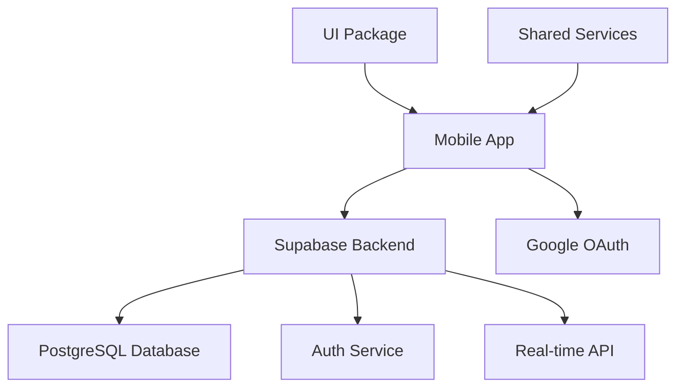

# 아키텍처 설계

## 전체 아키텍처



## 모바일 앱 아키텍처

### 폴더 구조
```
apps/mobile/
├── app/                 # Expo Router 페이지
├── src/
│   ├── components/      # 재사용 가능한 컴포넌트
│   ├── screens/         # 화면 컴포넌트
│   ├── services/        # 비즈니스 로직
│   └── stories/         # Storybook 스토리
└── ios/                 # iOS 네이티브 코드
```

### 서비스 레이어
- **authService**: 인증 관련 로직
- **supabaseClient**: Supabase 클라이언트 설정
- **llmGateway**: LLM 통합 (향후 확장)

## 데이터 플로우

1. **인증 플로우**
   ```
   사용자 → Google OAuth → Supabase Auth → 앱 세션
   ```

2. **데이터 플로우**
   ```
   컴포넌트 → Service → Supabase → Database
   ```

## 보안 고려사항
- OAuth 토큰은 Supabase에서 관리
- 환경 변수로 민감한 정보 보호
- Deep Link을 통한 안전한 OAuth 리다이렉트
